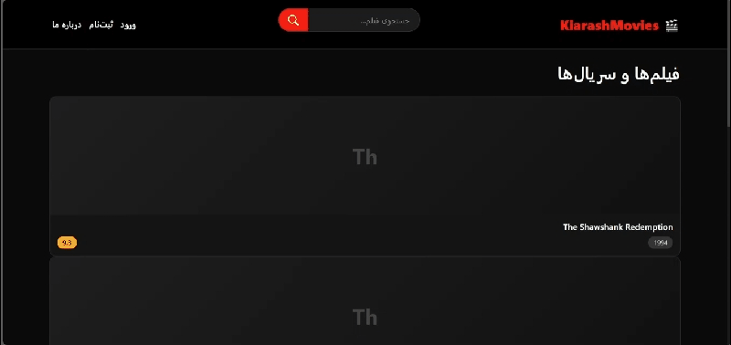

``markdown
<div align="center">

# 🎬 KiarashMovies

*A personal Netflix, born in the darkness of war and internet shutdowns.

[!Python](https://img.shields.io/badge/Python-3.10+-blue?style=for-the-badge&logo=python)
[!Django](https://img.shields.io/badge/Django-4.2-green?style=for-the-badge&logo=django)
[!MySQL](https://img.shields.io/badge/MySQL-8.0-orange?style=for-the-badge&logo=mysql)
[!BeautifulSoup](https://img.shields.io/badge/BeautifulSoup-4-yellow?style=for-the-badge&logo=python)
[!Bootstrap](https://img.shields.io/badge/Bootstrap-5.3-purple?style=for-the-badge&logo=bootstrap)
[!License](https://img.shields.io/badge/License-MIT-red?style=for-the-badge)

<p align="center">
  
</p>

</div>

---

## 📖 چرا این پروژه رو ساختم؟

<div dir="rtl" align="right">

اون روزا، توی اوج بمبارون و قطعی اینترنت :) ، یه لینک ساده HTML دستم رسید. توی اون فایل، ۵۰۰۰ تا از بهترین فیلم‌های تاریخ سینما لیست شده بود. بدون پوستر، بدون توضیحات، بدون گرافیک. فقط اسم فیلم، کد IMDb و لینک دانلود.

همون‌جا تصمیم گرفتم از دل این فایل خشک و خالی، یه چیز واقعی بسازم. یه پلتفرم برای خودم و بقیه که بشه توش فیلم‌ها رو جستجو کرد، دید، و لذت برد.

</div>

---

## ✨ Features

- Web Scraping Engine — Extracted 5000+ movies from a single raw HTML file using BeautifulSoup, with parallel processing via `ThreadPoolExecutor` for speed.
- Powerful Search — Instant full-text search across all 5000 movies. Find what you want in milliseconds.
- Phone-based Authentication — No old-school usernames. Users sign up with their phone number, name, and email. Everything is hashed and secure.
- Direct Download Links — Multiple quality options (1080p, 720p, 480p) with file sizes, separated into SoftSub and Dubbed categories.
- IMDb Ratings & Votes — Real IMDb scores and vote counts for every single movie.
- Dark, Netflix-style UI — Responsive, RTL-supported, dark theme built with Bootstrap 5. Looks great on every screen.
- Security First — PBKDF2 password hashing, CSRF protection, auto-escaping against XSS, and ORM-based queries to prevent SQL injection.
- Admin Dashboard — Full control via Django's built-in admin panel.

---

## 🗺️ Roadmap

This project is alive and growing. Here's what's coming next:

- 🖼️ Movie Posters — Pull posters from OMDb / TMDB API  
- 🎬 Trailers — Embedded YouTube trailers  
- 💬 Comments & Ratings — Let users leave reviews and rate movies  
- ⭐ Watchlist — Personal "want to watch" list per user  
- 🤖 Smart Recommendations — Suggest movies based on taste  
- 📱 PWA Support — Installable on mobile like a native app  
- 🌐 REST API — Public API for other applications  
- 🎭 Genre Filtering — Browse by genre  
- 📅 Watch History — Track what you've seen  

---

## 🛠️ Tech Stack

| Technology | Role |
|-----------|------|
| Python 3.10+ | Core language |
| Django 4.2 | Backend framework |
| MySQL 8.0 | Database |
| BeautifulSoup 4 | Web scraping |
| ThreadPoolExecutor | Parallel processing |
| Bootstrap 5.3 | Frontend UI |
| HTML/CSS* | Structure & styling |

---

## 📁 Project Structure

```

Kiarashmovies/
├── manage.py
├── requirements.txt
├── .gitignore
├── demo.gif
├── README.md
│
├── Kiarashmovies/            # Project config
│   ├── settings.py
│   ├── urls.py
│   └── wsgi.py
│
├── movies/                   # Main app
│   ├── models.py             # User & Movie models
│   ├── views.py              # Auth, search, views
│   ├── forms.py              # Validation forms
│   ├── urls.py
│   └── management/
│       └── commands/
│           └── import_movies.py
│
├── templates/                # HTML templates
│   ├── base.html
│   └── movies/
│       ├── home.html
│       ├── login.html
│       └── register.html
│
├── static/

# Static files (CSS, JS)
└── movies_data/              # Source HTML file
└── top_5000_movies.html


---

## 🚀 Getting Started

### Prerequisites
- Python 3.10+
- MySQL 8.0+
- pip

### Installation

**1. Clone the repository**
```bash
git clone https://github.com/YOUR_USERNAME/Kiarashmovies.git
cd Kiarashmovies

2. Set up a virtual environment

python -m venv venv

# Windows
venv\Scripts\activate

# Linux/macOS
source venv/bin/activate

3. Install dependencies

pip install -r requirements.txt

4. Set up the MySQL database

CREATE DATABASE KiarashMovies CHARACTER SET utf8mb4 COLLATE utf8mb4_unicode_ci;
CREATE USER 'kiarash'@'localhost' IDENTIFIED BY 'YourPassword';
GRANT ALL PRIVILEGES ON KiarashMovies.* TO 'kiarash'@'localhost';
FLUSH PRIVILEGES;

Then update Kiarashmovies/settings.py with your database credentials.

5. Run migrations

python manage.py makemigrations movies
python manage.py migrate

6. Create a superuser

python manage.py createsuperuser --phone=09123456789 --email=admin@example.com --name="YourName"

7. Import movies
Place the top_5000_movies.html file in the movies_data/ folder, then run:

python manage.py import_movies

8. Start the server

python manage.py runserver

Open your browser and go to http://127.0.0.1:8000

---

🔒 Security Notes

· Passwords hashed with Django's PBKDF2 algorithm
· Authentication via phone number (no traditional username)
· SQL injection prevention via Django's ORM
· CSRF protection enforced on all forms
· XSS protection via auto-escaping in templates
· All content pages require authentication (@login_required)

---

🤝 Contributing

I built this with love in tough times. If you want to help it grow:

1. Fork the project
2. Create a feature branch (git checkout -b feature/amazing-feature)
3. Commit your changes (git commit -m 'Add amazing feature')
4. Push to the branch (git push origin feature/amazing-feature)
5. Open a Pull Request

---

📄 License

This project is licensed under the MIT License — do whatever you want with it, just give it a ⭐ if you like it!

---

<div align="center">

Built with love during the days when there was no internet. 💙

</div>
```